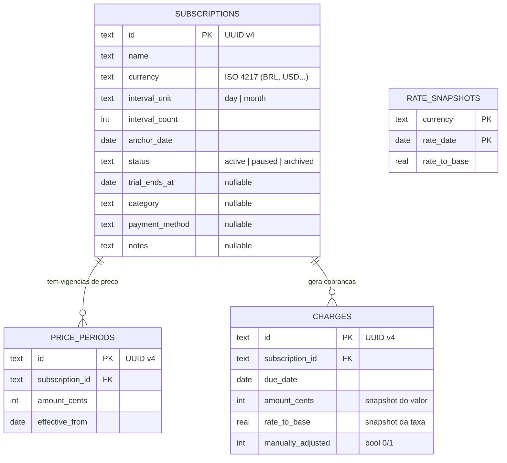

# Sina

Gestor de assinaturas **offline-first** sem nenhuma integração bancária, o usuário é a única fonte da verdade sobre suas cobranças. O app mantém um ledger histórico e imutável de eventos de cobrança, com catch-up automático, notificações locais e relatórios de gasto consolidados.

## Modelo de dados (ERD)



## Arquitetura

Feature-first com domínio central ("CQRS-lite"):

```
lib/
  core/           # tema, i18n, formatadores, extensões
  domain/         # PURO: sem Flutter, sem Drift, sem plugins
    models/         subscription.dart, charge.dart, money.dart, cycle.dart
    services/       recurrence_calculator.dart, charge_materializer.dart,
                    currency_converter.dart
    errors/         sealed classes de erros de domínio
  data/           # Drift (tables, DAOs), repositórios, API de câmbio,
                  # NotificationScheduler (implementação)
  features/       # só apresentação: pages, widgets, providers/controllers
    subscriptions/
    ledger/
    dashboard/
    settings/
```

- Comandos (escrita) descem `UI → Controller (AsyncNotifier) → Repositório → Drift`, retornando `Result<void, ErroDeDominio>`.
- Consultas (leitura) sobem por caminho separado e reativo: `Drift (watch query) → StreamProvider → UI (AsyncValue)`.

## Stack

- Flutter
- Riverpod
- Drift (SQLite)
- shared_preferences
- flutter_local_notifications
- Frankfurter (câmbio)
- Sentry (crash reporting).

## Rodando o projeto

```bash
flutter pub get
flutter run
```
